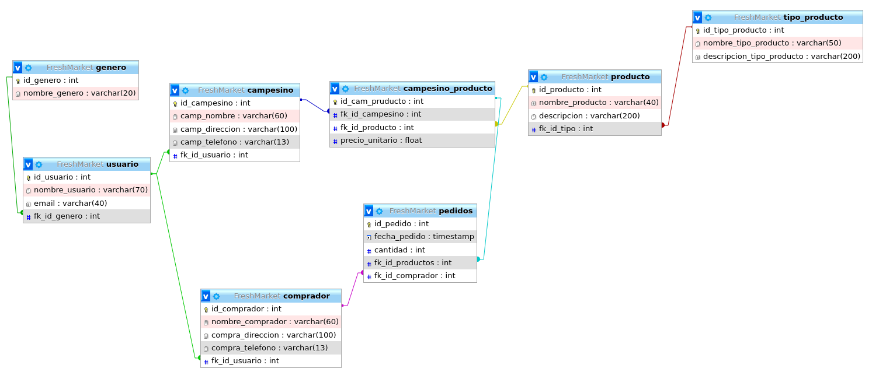

*** 🌱 FreshMarket 🍅 ***

# Finalidad del proyecto
- Este proyecto busca facilitar la conexión directa entre los campesinos y los consumidores a través de una aplicación, promoviendo la venta de productos frescos y de calidad sin intermediarios innecesarios. Al hacerlo, buscas empoderar a los campesinos, ayudarles a obtener mejores precios por sus productos y brindar a los consumidores acceso a alimentos saludables y sostenibles.

# Maqueta basica de la base de datos
#### Tabla de Usuarios:
    Esta tabla almacenará la información de los usuarios de la aplicación, incluyendo campesinos y consumidores.

#### Tabla de Productos:
    Esta tabla contendrá la información sobre los productos que los campesinos tienen a la venta.

#### Tabla de Pedidos:
    Esta tabla mantendrá un registro de los pedidos realizados por los consumidores.

#### Tabla de Detalles del Pedido:
    Esta tabla almacenará los detalles específicos de cada pedido realizado.

#### Tabla de Transacciones:
    Esta tabla registrará todas las transacciones monetarias realizadas dentro de la aplicación.

### Mas aserca del proyecto
- consiste en crear una aplicación que actúa como un mercado virtual, permitiendo a los campesinos vender directamente sus productos a los consumidores. El objetivo principal es eliminar intermediarios y promover la venta directa, lo que beneficia tanto a los campesinos al obtener mejores precios por sus productos, como a los consumidores al acceder a alimentos frescos y de calidad.

La aplicación ofrecerá un entorno donde los campesinos podrán registrar su información y los productos que desean vender. Cada producto estará asociado con detalles como nombre, descripción, precio y disponibilidad. Los consumidores, por otro lado, podrán explorar la aplicación, buscar productos de su interés y realizar pedidos directamente a los campesinos.

Cuando un consumidor realiza un pedido, se registra en la base de datos y se crea un registro de detalles del pedido, que incluye información como el producto solicitado, la cantidad, el precio unitario y el subtotal. Los campesinos recibirán notificaciones de los pedidos realizados y podrán gestionarlos, actualizando el estado del pedido (por ejemplo, en proceso, completado, cancelado) a medida que avanzan en su procesamiento y entrega.

# Objetivo General

- El objetivo general de este proyecto es desarrollar una aplicación que promueva la venta directa de productos agrícolas entre campesinos y consumidores, eliminando intermediarios y fomentando una relación más directa y transparente. Al lograrlo, esperas alcanzar los siguientes objetivos específicos:

Facilitar la conexión: Proporcionar una plataforma intuitiva y fácil de usar que permita a los campesinos mostrar y vender sus productos directamente a los consumidores interesados.
Promover la venta local: Fomentar el consumo de productos agrícolas locales al facilitar que los consumidores encuentren y compren directamente a los campesinos de su área, apoyando así la economía local y reduciendo la dependencia de cadenas de suministro más largas.
Mejorar la rentabilidad de los campesinos: Permitir que los campesinos obtengan un mayor beneficio económico al vender directamente sus productos, evitando intermediarios y sus correspondientes comisiones.
Ofrecer alimentos frescos y de calidad: Permitir a los consumidores acceder a productos agrícolas frescos, de temporada y de alta calidad, al reducir el tiempo y la distancia entre la cosecha y el consumo.
Promover la transparencia: Proporcionar información detallada sobre los productos, incluyendo su origen, métodos de producción y certificaciones, para que los consumidores puedan tomar decisiones informadas sobre sus compras.
Mejorar la trazabilidad: Establecer un sistema de seguimiento que permita a los consumidores conocer el origen y el recorrido de los productos, brindando transparencia y seguridad alimentaria.
Impulsar la sostenibilidad: Promover prácticas agrícolas sostenibles al conectar a los consumidores con campesinos comprometidos con la agricultura ecológica, regenerativa y respetuosa con el medio ambiente.


### Diagrama de la base de datos


# Manual para usar el API 

### Endpoinds para la tabla usuarios
###### Endpoind #1
- Method = GET
http://127.121.12.6:9103/usuario/mostrar/:id_usuario

Ejemplo: http://127.121.12.6:9103/usuario/mostrar/2
- Este endpoind me muestra los datos de un usuario segun su id pasado por la URL

###### Endpoind #2
- Method = POST
http://127.121.12.6:9103/usuario/insertar/campesino

Ejemplo De data a enviar:
```json 
{
    "id_usuario":422, 
    "nombre_usuario":"CarAlmeida121",
    "email":"jhon@gamil.com",
    "fk_id_genero":1,
    "camp_nombre":"Jhon calos Almeida",
    "camp_direccion":"Floridablanca la casa blanca",
    "camp_telefono":"3224757536"
}
```
- Este endpoind me agrega un usuario campesino 


###### Endpoind #3
- Method = POST
http://127.121.12.6:9103/usuario/insertar/comprador

Ejemplo De data a enviar:
```json 
{
    "id_usuario":322,
    "nombre_usuario":"CarAlmeida121",
    "email":"jhon@gamil.com",
    "fk_id_genero":1,
    "nombre_comprador":"Jhon calos Almeida",
    "compra_direccion":"Floridablanca la casa blanca",
    "compra_telefono":"3224757536"
}
```
- Este endpoind me agrega un usuario comprador

###### Endpoind #4
- Method = DELETE
http://127.121.12.6:9103/usuario/eliminar

Ejemplo De data a enviar:
```json 
{
    "id_eliminar":123
}
```
- Este endpoind me elimina un usuario comprador ya sea comprador o campesino

###### Endpoind #5
- Method = PUT
http://127.121.12.6:9103/usuario/actualizar/campesino

Ejemplo De data a enviar:
```json 
{
    "id_usuario":322, 
    "nombre_usuario":"CarAlmeida121",
    "email":"jhon@gamil.com",
    "fk_id_genero":1,
    "nombre_comprador":"Jhon calos Almeida",
    "compra_direccion":"Floridablanca la casa blanca",
    "compra_telefono":"3224757536"
}
```
- Este endpoind me actualiza un usuario campesino 

###### Endpoind #6
- Method = PUT
http://127.121.12.6:9103/usuario/actualizar/comprador

Ejemplo De data a enviar:
```json 
{
    "id_usuario":322, 
    "nombre_usuario":"CarAlmeida121",
    "email":"jhon@gamil.com",
    "fk_id_genero":1,
    "camp_nombre":"Jhon calos Almeida",
    "camp_direccion":"Floridablanca la casa blanca",
    "camp_telefono":"3224757536"
}
```
- Este endpoind me actualiza un usuario comprador 


